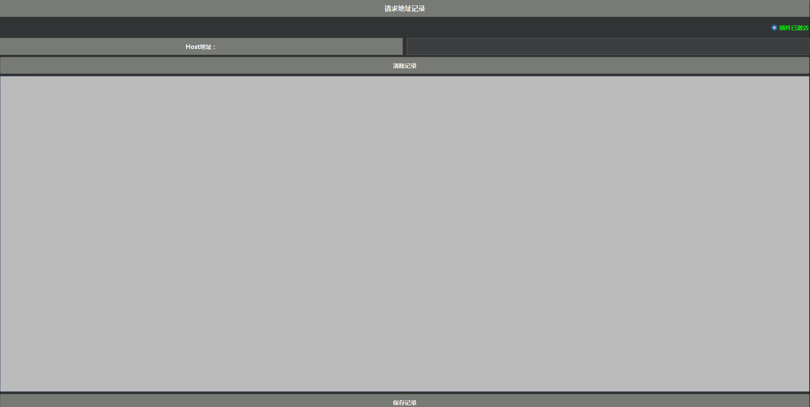

# ReqUrlRecord

插件说明: 获取BurpSuite请求列表中URL地址,可以进行导出保存.

开发环境：IDEA + Maven

BurpSuite接口：Legacy版本API接口

Maven引入依赖：

``` XML
<dependency>
    <groupId>net.portswigger.burp.extender</groupId>
    <artifactId>burp-extender-api</artifactId>
    <version>2.3</version>
</dependency>
```

插件页面截图


